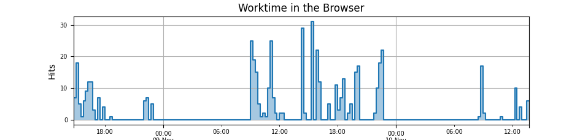

# Firefox History Stats

## Description

Command line script to create statistics from the Firefox browsing history. 

## Visuals

  
*Work related hits using the Firefox browser*

## Installation

- Python 3.9
- Install `requirements.txt`
- Run the app according to "Usage"

## Usage

```bash
usage: firefox-history-stats.py [-h] [--db DB] [--days DAYS] [--match MATCH] [--tz TZ]

Read browsing history of Firefox and create report.

optional arguments:
  -h, --help     show this help message and exit
  --db DB        Path to 'places.sqlite' file of Firefox
  --days DAYS    Number of days from the past
  --match MATCH  Regex match for domain filter
  --tz TZ        Timezone (default: Europe/Berlin)
```
### Examples

`python3.9 firefox-history-stats.py -h`

`python3.9 firefox-history-stats.py --match google --days 10`


## Authors and acknowledgment
Roland Ortner (ortner@symptoma.com)

## License

For open source projects, say how it is licensed.
